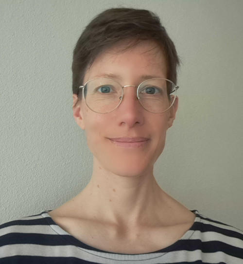

```{=html}
<div class="cv-document">

<aside class="cv-sidebar">
  <header class="cv-sidebar-header">
    
  </header>

  <section class="cv-sidebar-block">
    <h2 class="cv-sidebar-title">Contact</h2>
    <ul class="cv-contact-list">
      <li>
        <i class="bi bi-github cv-contact-icon" role="img" aria-hidden="true"></i>
        <a href="https://github.com/florence-bockting" target="_blank" rel="noopener">github.com/florence-bockting</a>
      </li>
      <li>
        <i class="bi bi-linkedin cv-contact-icon" role="img" aria-hidden="true"></i>
        <a href="https://www.linkedin.com/in/florence-bockting/" target="_blank" rel="noopener">linkedin.com/in/florence-bockting</a>
      </li>
      <li>
        <i class="bi bi-bluesky cv-contact-icon" role="img" aria-hidden="true"></i>
        <a href="https://bsky.app/profile/florencebockting.bsky.social" target="_blank" rel="noopener">florencebockting.bsky.social</a>
      </li>
    </ul>
  </section>

  <section class="cv-sidebar-block">
    <h2 class="cv-sidebar-title">Languages</h2>
    <ul class="cv-skill-list">
      <li>German <span class="cv-skill-level">(mother language)</span></li>
      <li>English <span class="cv-skill-level">(fluent)</span></li>
      <li>French <span class="cv-skill-level">(intermediate)</span></li>
    </ul>
  </section>

  <section class="cv-sidebar-block cv-sidebar-skills">
    <h2 class="cv-sidebar-title">Skills</h2>

    <div class="cv-skill-group">
      <h3 class="cv-skill-subhead">Core skills</h3>
      <ul class="cv-skill-list">
        <li>Python, R</li>
        <li>Bayesian statistics</li>
        <li>Research software engineering</li>
        <li>Data pipelines</li>
        <li>Reproducible science</li>
      </ul>
    </div>

    <div class="cv-skill-group">
      <h3 class="cv-skill-subhead">Focus areas</h3>
      <ul class="cv-skill-list">
        <li>Open source software</li>
        <li>Bayesian methods</li>
        <li>Computational modelling</li>
        <li>Cognitive &amp; social science</li>
      </ul>
    </div>
  </section>

  <section class="cv-sidebar-block cv-sidebar-skills">
    <h2 class="cv-sidebar-title">Programming &amp; tools</h2>

    <div class="cv-skill-group">
      <h3 class="cv-skill-subhead">Languages</h3>
      <p class="cv-skill-tags">Python, R, Stan</p>
    </div>
    <div class="cv-skill-group">
      <h3 class="cv-skill-subhead">RSE workflow</h3>
      <p class="cv-skill-tags">Git, GitHub Actions, pytest, testthat, Quarto, Jupyter, JupyText, Rmd</p>
    </div>
    <div class="cv-skill-group">
      <h3 class="cv-skill-subhead">Packaging &amp; docs</h3>
      <p class="cv-skill-tags">uv, pixi, renv, PyPI, conda-forge, Sphinx, Read the Docs</p>
    </div>
    <div class="cv-skill-group">
      <h3 class="cv-skill-subhead">Pipelines &amp; compute</h3>
      <p class="cv-skill-tags">Prefect, HPC, Linux</p>
    </div>
  </section>
</aside>

<main class="cv-main">

  <section class="cv-section cv-section-experiences">
    <h2 class="cv-section-title">Experiences</h2>

    <div class="cv-exp-timeline">

    <article class="cv-exp-item cv-exp-item-current">
      <div class="cv-exp-marker" aria-hidden="true"><i class="bi bi-briefcase-fill"></i></div>
      <div class="cv-exp-body">
        <header class="cv-exp-header">
          <div class="cv-exp-heading">
            <h3 class="cv-exp-title">Research Scientist / Research Software Engineer</h3>
            <p class="cv-exp-org">Bayesian Workflow Group, Computer Science Department</p>
            <p class="cv-exp-meta">Aalto University, Espoo, Finland · PI: Prof. Dr. Aki Vehtari</p>
          </div>
          <div class="cv-exp-aside">
            <span class="cv-exp-badge">Current</span>
            <time class="cv-exp-date" datetime="2026">2026 – Present</time>
          </div>
        </header>
        <ul class="cv-exp-bullets">
          <li>Postdoctoral research software engineer implementing Bayesian statistics in software, primarily within the Stan ecosystem (Python and R)</li>
          <li>R package development: implementing novel research results in open-source software; improving, refactoring, and maintaining existing R packages</li>
        </ul>
      </div>
    </article>

    <article class="cv-exp-item">
      <div class="cv-exp-marker" aria-hidden="true"><i class="bi bi-briefcase"></i></div>
      <div class="cv-exp-body">
        <header class="cv-exp-header">
          <div class="cv-exp-heading">
            <h3 class="cv-exp-title">Research Scientist / Research Software Engineer</h3>
            <p class="cv-exp-org">Climate Resource GmbH</p>
            <p class="cv-exp-meta">Berlin, Germany</p>
          </div>
          <time class="cv-exp-date" datetime="2025">2025 – 2026</time>
        </header>
        <ul class="cv-exp-bullets">
          <li>Research scientist and software engineer developing greenhouse-gas concentration data pipelines for earth system modelling groups</li>
          <li>ESA-funded project: designed and implemented a data pipeline covering scraping, preprocessing, and assimilation of multi-source observational data (ground-based and satellite), resulting in a unified, standardised data product</li>
        </ul>
      </div>
    </article>

    <article class="cv-exp-item">
      <div class="cv-exp-marker" aria-hidden="true"><i class="bi bi-people"></i></div>
      <div class="cv-exp-body">
        <header class="cv-exp-header">
          <div class="cv-exp-heading">
            <h3 class="cv-exp-title">Consultant</h3>
            <p class="cv-exp-org">Jacobs Foundation, Zürich, Switzerland</p>
          </div>
          <time class="cv-exp-date" datetime="2025-08">Aug – Dec 2025</time>
        </header>
        <ul class="cv-exp-bullets">
          <li>Focus area: Expert prior elicitation</li>
          <li>Prepare and inform about expert prior elicitation to support internal decision-making processes</li>
        </ul>
      </div>
    </article>

    <article class="cv-exp-item">
      <div class="cv-exp-marker" aria-hidden="true"><i class="bi bi-mortarboard"></i></div>
      <div class="cv-exp-body">
        <header class="cv-exp-header">
          <div class="cv-exp-heading">
            <h3 class="cv-exp-title">Research Scientist</h3>
            <p class="cv-exp-org">Computational Statistics, Statistics Department</p>
            <p class="cv-exp-meta">TU Dortmund University, Dortmund, Germany · PI: Prof. Dr. Paul-Christian Bürkner</p>
          </div>
          <time class="cv-exp-date" datetime="2022">2022 – 2025</time>
        </header>
        <ul class="cv-exp-places">
          <li><span class="cv-exp-place-date">2023 – 2025</span> TU Dortmund University</li>
          <li><span class="cv-exp-place-date">2022 – 2023</span> SC SimTech, University of Stuttgart</li>
        </ul>
        <ul class="cv-exp-bullets">
          <li>Doctoral research in computational statistics on simulation-based expert prior elicitation</li>
          <li>Developed a method for learning prior distributions in Bayesian models from expert knowledge; implemented the approach as the open-source Python package elicito (PyPI and conda-forge)</li>
        </ul>
      </div>
    </article>

    <article class="cv-exp-item">
      <div class="cv-exp-marker" aria-hidden="true"><i class="bi bi-briefcase"></i></div>
      <div class="cv-exp-body">
        <header class="cv-exp-header">
          <div class="cv-exp-heading">
            <h3 class="cv-exp-title">Research Scientist</h3>
            <p class="cv-exp-org">Methods &amp; Statistics, Psychology Department</p>
            <p class="cv-exp-meta">Philipps-University Marburg, Marburg, Germany · PI: Prof. Dr. Daniel W. Heck</p>
          </div>
          <time class="cv-exp-date" datetime="2020">2020 – 2022</time>
        </header>
        <ul class="cv-exp-bullets">
          <li>Focus areas: Statistical method development, computational and mathematical modelling, social psychology, formalisation of verbal theories</li>
          <li>Formalised a verbal theory of truth judgment and the truth effect in social psychology by developing a computational model in R</li>
        </ul>
      </div>
    </article>

    <article class="cv-exp-item cv-exp-item-muted">
      <div class="cv-exp-marker" aria-hidden="true"><i class="bi bi-easel"></i></div>
      <div class="cv-exp-body">
        <header class="cv-exp-header">
          <div class="cv-exp-heading">
            <h3 class="cv-exp-title">Tutor &amp; Student Assistant</h3>
          </div>
          <time class="cv-exp-date" datetime="2015">2015 – 2020</time>
        </header>
        <ul class="cv-exp-bullets">
          <li>Supported lecture preparation and led exercise seminars across a range of courses, including Data Ethics, Statistics, Computational Data Analysis, Bayesian Data Analysis, General Psychology, and Experimental Psychology</li>
        </ul>
      </div>
    </article>

    <article class="cv-exp-item cv-exp-item-muted">
      <div class="cv-exp-marker" aria-hidden="true"><i class="bi bi-clipboard-data"></i></div>
      <div class="cv-exp-body">
        <header class="cv-exp-header">
          <div class="cv-exp-heading">
            <h3 class="cv-exp-title">Research Assistant</h3>
            <p class="cv-exp-org">Produkt+Markt GmbH, Osnabrück</p>
          </div>
          <time class="cv-exp-date" datetime="2018">2018 – 2019</time>
        </header>
        <ul class="cv-exp-bullets">
          <li>Conducted qualitative and quantitative market research in the healthcare sector</li>
          <li>Responsibilities included coding qualitative questionnaires, descriptive data analysis, and preparing presentations and reports</li>
        </ul>
      </div>
    </article>

    <article class="cv-exp-item cv-exp-item-muted">
      <div class="cv-exp-marker" aria-hidden="true"><i class="bi bi-diagram-3"></i></div>
      <div class="cv-exp-body">
        <header class="cv-exp-header">
          <div class="cv-exp-heading">
            <h3 class="cv-exp-title">Project member – Student Skills Matching Platform</h3>
          </div>
          <time class="cv-exp-date" datetime="2018">2018</time>
        </header>
        <ul class="cv-exp-bullets">
          <li>Contributed to the development of a platform for matching students based on skills; carried out a needs analysis and led the conceptual design of the matching system</li>
        </ul>
      </div>
    </article>

    <article class="cv-exp-item cv-exp-item-group">
      <div class="cv-exp-marker" aria-hidden="true"><i class="bi bi-signpost-split"></i></div>
      <div class="cv-exp-body">
        <header class="cv-exp-header">
          <div class="cv-exp-heading">
            <h3 class="cv-exp-title">Internships</h3>
          </div>
        </header>
        <ul class="cv-exp-internships">
          <li>
            <time class="cv-exp-intern-date" datetime="2017">2017</time>
            <span>Qualitative Market Research in Healthcare – Ipsos GmbH, Hamburg</span>
          </li>
          <li>
            <time class="cv-exp-intern-date" datetime="2016">2016</time>
            <span>General Psychology and Methodology (PI: Prof. Dr. Claus-Christian Carbon), University of Bamberg</span>
          </li>
        </ul>
      </div>
    </article>

    </div>
  </section>

  <section class="cv-section cv-section-education">
    <h2 class="cv-section-title">Education</h2>
    <div class="cv-exp-timeline">

    <article class="cv-exp-item cv-exp-item-highlight">
      <div class="cv-exp-marker" aria-hidden="true"><i class="bi bi-mortarboard-fill"></i></div>
      <div class="cv-exp-body">
        <header class="cv-exp-header">
          <div class="cv-exp-heading">
            <h3 class="cv-exp-title">Doctorate in Computational Statistics</h3>
            <p class="cv-exp-org">TU Dortmund University, Dortmund, Germany</p>
            <p class="cv-exp-meta"><em>Simulation-based expert prior elicitation: Method and software development</em></p>
          </div>
          <time class="cv-exp-date" datetime="2026">2026</time>
        </header>
        <ul class="cv-exp-bullets">
          <li>Doctoral thesis at SimTech / University of Stuttgart and TU Dortmund University</li>
          <li>Awarded <em>magna cum laude</em></li>
        </ul>
      </div>
    </article>

    <article class="cv-exp-item">
      <div class="cv-exp-marker" aria-hidden="true"><i class="bi bi-mortarboard"></i></div>
      <div class="cv-exp-body">
        <header class="cv-exp-header">
          <div class="cv-exp-heading">
            <h3 class="cv-exp-title">M.Sc. in Cognitive Science</h3>
            <p class="cv-exp-org">University of Osnabrück, Osnabrück, Germany</p>
          </div>
          <time class="cv-exp-date" datetime="2020">2020</time>
        </header>
        <ul class="cv-exp-bullets">
          <li>Majors: Cognitive modelling &amp; Artificial intelligence</li>
          <li>Graduated with distinction</li>
        </ul>
      </div>
    </article>

    <article class="cv-exp-item">
      <div class="cv-exp-marker" aria-hidden="true"><i class="bi bi-mortarboard"></i></div>
      <div class="cv-exp-body">
        <header class="cv-exp-header">
          <div class="cv-exp-heading">
            <h3 class="cv-exp-title">B.Sc. in Business Psychology</h3>
            <p class="cv-exp-org">University of Applied Sciences Harz, Wernigerode, Germany</p>
          </div>
          <time class="cv-exp-date" datetime="2018">2018</time>
        </header>
        <ul class="cv-exp-bullets">
          <li>Majors: Market research &amp; Consumer behaviour</li>
          <li>Graduated with distinction</li>
        </ul>
      </div>
    </article>

    <article class="cv-exp-item cv-exp-item-muted">
      <div class="cv-exp-marker" aria-hidden="true"><i class="bi bi-patch-check"></i></div>
      <div class="cv-exp-body">
        <header class="cv-exp-header">
          <div class="cv-exp-heading">
            <h3 class="cv-exp-title">Marketing Communications Specialist</h3>
            <p class="cv-exp-org">Vocational training certified by IHK (Chamber of Industry &amp; Commerce)</p>
            <p class="cv-exp-meta">Dresden-Informatik GmbH, Dresden, Germany</p>
          </div>
          <time class="cv-exp-date" datetime="2014">2014</time>
        </header>
      </div>
    </article>

    </div>
  </section>

  <section class="cv-section cv-section-teaching">
    <h2 class="cv-section-title">Teaching &amp; Thesis Supervision</h2>
    <div class="cv-exp-timeline">

    <article class="cv-exp-item">
      <div class="cv-exp-marker" aria-hidden="true"><i class="bi bi-easel"></i></div>
      <div class="cv-exp-body">
        <header class="cv-exp-header">
          <div class="cv-exp-heading">
            <h3 class="cv-exp-title">Master Seminar on Multilevel Modelling</h3>
          </div>
          <time class="cv-exp-date" datetime="2023">2023 – 2024</time>
        </header>
        <ul class="cv-exp-bullets">
          <li>Target audience: Master students in Data Science, Statistics, and Econometrics</li>
          <li>Introduction to the theory and analysis of multilevel models using R, from both Bayesian and frequentist perspectives</li>
          <li>Language of instruction: English</li>
        </ul>
      </div>
    </article>

    <article class="cv-exp-item">
      <div class="cv-exp-marker" aria-hidden="true"><i class="bi bi-code-slash"></i></div>
      <div class="cv-exp-body">
        <header class="cv-exp-header">
          <div class="cv-exp-heading">
            <h3 class="cv-exp-title">Programming course: Introduction into Python</h3>
          </div>
          <time class="cv-exp-date" datetime="2023">2023 – 2025</time>
        </header>
        <ul class="cv-exp-bullets">
          <li>Target audience: Master and Bachelor students in Data Science, Statistics, and Econometrics</li>
          <li>Fundamentals of Python, documentation with Sphinx, testing with Pytest, and version control with Git and GitHub</li>
          <li>Language of instruction: English, German</li>
        </ul>
      </div>
    </article>

    <article class="cv-exp-item cv-exp-item-group">
      <div class="cv-exp-marker" aria-hidden="true"><i class="bi bi-journal-text"></i></div>
      <div class="cv-exp-body">
        <header class="cv-exp-header">
          <div class="cv-exp-heading">
            <h3 class="cv-exp-title">Supervision of theses</h3>
          </div>
          <time class="cv-exp-date" datetime="2020">2020 – 2025</time>
        </header>
        <ul class="cv-exp-internships cv-exp-theses">
          <li><span class="cv-exp-intern-date">BSc</span><span>Analysis of different initialization approaches for hyperparameter optimization with mini-batch stochastic gradient descent: A simulation study · TU Dortmund</span></li>
          <li><span class="cv-exp-intern-date">MSc</span><span>Sensitivity analysis and performance evaluation of varying upper thresholds for discrete likelihoods · TU Dortmund</span></li>
          <li><span class="cv-exp-intern-date">BSc</span><span>The influence of response scales on the knowledge gain of underlying cognitive mechanisms: The role of uncertainty and truth perception in the Truth Effect · Philipps-Universität Marburg</span></li>
          <li><span class="cv-exp-intern-date">BSc</span><span>Empirical test of core assumptions of the Referential Theory: Influence of repetition on perceived coherence · Philipps-Universität Marburg</span></li>
          <li><span class="cv-exp-intern-date">BSc</span><span>Identification and testing of relevant psychological factors on truth judgments and the truth effect according to the Referential Theory · Philipps-Universität Marburg</span></li>
          <li><span class="cv-exp-intern-date">BSc</span><span>Truth Effect — The role of the response scale in truth effect designs with short delay · Philipps-Universität Marburg</span></li>
        </ul>
      </div>
    </article>

    </div>
  </section>

  <section class="cv-section cv-section-publications">
    <h2 class="cv-section-title">Publications &amp; Talks</h2>
    <div class="cv-exp-timeline cv-pub-timeline">

    <article class="cv-exp-item cv-exp-item-compact">
      <div class="cv-exp-marker" aria-hidden="true"><i class="bi bi-mortarboard"></i></div>
      <div class="cv-exp-body">
        <p class="cv-pub-entry"><span class="cv-pub-year">2026</span> <strong>Bockting, F.</strong> <em>Simulation-based expert prior elicitation: Method and software development.</em> Doctoral Thesis. TU Dortmund University.</p>
      </div>
    </article>
    <article class="cv-exp-item cv-exp-item-compact">
      <div class="cv-exp-marker" aria-hidden="true"><i class="bi bi-mic"></i></div>
      <div class="cv-exp-body">
        <p class="cv-pub-entry"><span class="cv-pub-year">2025</span> <strong>Bockting, F.</strong> Invited Talk: <em>Predictive Prior Elicitation: State of the Art &amp; Current Challenges</em>, Workshop on Bayesian Modelling, Lund University</p>
      </div>
    </article>
    <article class="cv-exp-item cv-exp-item-compact">
      <div class="cv-exp-marker" aria-hidden="true"><i class="bi bi-file-earmark-text"></i></div>
      <div class="cv-exp-body">
        <p class="cv-pub-entry"><span class="cv-pub-year">2025</span> <strong>Bockting, F.</strong> &amp; Bürkner, P. C. <strong>elicito</strong>: A Python Package for Expert Prior Elicitation. <em>arXiv preprint</em></p>
      </div>
    </article>
    <article class="cv-exp-item cv-exp-item-compact">
      <div class="cv-exp-marker" aria-hidden="true"><i class="bi bi-journal-richtext"></i></div>
      <div class="cv-exp-body">
        <p class="cv-pub-entry"><span class="cv-pub-year">2025</span> <strong>Bockting, F.</strong>, Radev, S. T., &amp; Bürkner, P. C. Expert-elicitation method for non-parametric joint priors using normalizing flows. <em>Statistics and Computing</em>, 35(5), 132.</p>
      </div>
    </article>
    <article class="cv-exp-item cv-exp-item-compact">
      <div class="cv-exp-marker" aria-hidden="true"><i class="bi bi-mic"></i></div>
      <div class="cv-exp-body">
        <p class="cv-pub-entry"><span class="cv-pub-year">2024</span> <strong>Bockting, F.</strong>, Radev S. T., &amp; Bürkner P. C. Contributed talk: Normalizing Flows for Simulation Based Expert Prior Elicitation. MathPsych</p>
      </div>
    </article>
    <article class="cv-exp-item cv-exp-item-compact">
      <div class="cv-exp-marker" aria-hidden="true"><i class="bi bi-mic"></i></div>
      <div class="cv-exp-body">
        <p class="cv-pub-entry"><span class="cv-pub-year">2024</span> <strong>Bockting, F.</strong>, Radev S. T., &amp; Bürkner P. C. Contributed talk: Simulation-Based Prior Knowledge Elicitation for Parametric Bayesian Models. ISBA</p>
      </div>
    </article>
    <article class="cv-exp-item cv-exp-item-compact">
      <div class="cv-exp-marker" aria-hidden="true"><i class="bi bi-mic"></i></div>
      <div class="cv-exp-body">
        <p class="cv-pub-entry"><span class="cv-pub-year">2024</span> <strong>Bockting, F.</strong>, Radev, S. T., &amp; Bürkner, P. C. Invited talk: Simulation Based Prior Knowledge Elicitation for Parametric Bayesian Models. Bayes@Lund</p>
      </div>
    </article>
    <article class="cv-exp-item cv-exp-item-compact">
      <div class="cv-exp-marker" aria-hidden="true"><i class="bi bi-journal-richtext"></i></div>
      <div class="cv-exp-body">
        <p class="cv-pub-entry"><span class="cv-pub-year">2024</span> <strong>Bockting, F.</strong>, Radev, S. T. &amp; Bürkner, P. C. Simulation-based prior knowledge elicitation for parametric Bayesian models. <em>Scientific Reports</em> 14, 17330.</p>
      </div>
    </article>
    <article class="cv-exp-item cv-exp-item-compact">
      <div class="cv-exp-marker" aria-hidden="true"><i class="bi bi-journal-richtext"></i></div>
      <div class="cv-exp-body">
        <p class="cv-pub-entry"><span class="cv-pub-year">2023</span> Heck, D. W., &amp; <strong>Bockting, F.</strong> Benefits of Bayesian model averaging for mixed-effects modeling. <em>Computational Brain &amp; Behavior</em>, 6(1), 35–49.</p>
      </div>
    </article>
    <article class="cv-exp-item cv-exp-item-compact">
      <div class="cv-exp-marker" aria-hidden="true"><i class="bi bi-journal-richtext"></i></div>
      <div class="cv-exp-body">
        <p class="cv-pub-entry"><span class="cv-pub-year">2023</span> van Doorn, J., …, <strong>Bockting, F.</strong> &amp; Aust, F. Bayes factors for mixed models: A discussion. <em>Computational Brain &amp; Behavior</em>, 6(1), 1–13.</p>
      </div>
    </article>
    <article class="cv-exp-item cv-exp-item-compact">
      <div class="cv-exp-marker" aria-hidden="true"><i class="bi bi-mic"></i></div>
      <div class="cv-exp-body">
        <p class="cv-pub-entry"><span class="cv-pub-year">2021</span> <strong>Bockting, F.</strong> &amp; Heck, D. W. Measuring Individual Differences in the Truth Effect: A formal analysis. Fast Talk at MathPsych</p>
      </div>
    </article>
    <article class="cv-exp-item cv-exp-item-compact">
      <div class="cv-exp-marker" aria-hidden="true"><i class="bi bi-book"></i></div>
      <div class="cv-exp-body">
        <p class="cv-pub-entry"><span class="cv-pub-year">2021</span> Stephan, A., …, <strong>Bockting, F.</strong>, … Nachwort. In Turing A. M. <em>Computing Machinery and Intelligence. Können Maschinen Denken?</em> (pp. 131–201). Reclam.</p>
      </div>
    </article>

    </div>
  </section>

  <section class="cv-section cv-section-workshops">
    <h2 class="cv-section-title">Workshops &amp; Courses</h2>
    <div class="cv-exp-timeline">

    <article class="cv-exp-item cv-exp-item-year">
      <div class="cv-exp-marker cv-exp-marker-year"><span class="cv-exp-year-text">2026</span></div>
      <div class="cv-exp-body">
        <ul class="cv-exp-bullets">
          <li>Introduction to cybersecurity, FITech, University of Turku</li>
          <li>Introductory penetration testing and security assessment, FITech, University of Jyväskylä</li>
          <li>Developing Secure Software, OpenSSF, Linux Foundation</li>
        </ul>
      </div>
    </article>

    <article class="cv-exp-item cv-exp-item-year">
      <div class="cv-exp-marker cv-exp-marker-year"><span class="cv-exp-year-text">2024</span></div>
      <div class="cv-exp-body">
        <ul class="cv-exp-bullets">
          <li>Copyright for Computer Programs &amp; Software, TU Dortmund University</li>
          <li>Research Software Engineering Summer School, Karlsruhe Institute of Technology (KIT)</li>
        </ul>
      </div>
    </article>
    <article class="cv-exp-item cv-exp-item-year">
      <div class="cv-exp-marker cv-exp-marker-year"><span class="cv-exp-year-text">2023</span></div>
      <div class="cv-exp-body">
        <ul class="cv-exp-bullets">
          <li>Theory of Science, Prof. Dr. Zoglauer, University of Stuttgart</li>
          <li>Foundations of Deep Learning for the Social Sciences, University of Tübingen</li>
          <li>The Statistics Wars and Their Casualties (online seminar series), Prof. Dr. Deborah Mayo, Prof. Dr. Roman Frigg, &amp; Prof. Dr. Margherita Harris</li>
        </ul>
      </div>
    </article>
    <article class="cv-exp-item cv-exp-item-year">
      <div class="cv-exp-marker cv-exp-marker-year"><span class="cv-exp-year-text">2022</span></div>
      <div class="cv-exp-body">
        <ul class="cv-exp-bullets">
          <li>Summer School on Advanced Bayesian Data Analysis with Stan, Dr. Bruno Nicenboim, University of Potsdam</li>
          <li>Interval Hypothesis Testing, Prof. Dr. Daniël Lakens, University of Eindhoven</li>
          <li>Robust Cognitive Bayesian Analysis, Prof. Dr. Jeffrey N. Rouder, University of California</li>
          <li>Bayesian Evaluation of (informative) Hypotheses, Prof. Dr. Herbert Hoijtink, University of Utrecht</li>
        </ul>
      </div>
    </article>
    <article class="cv-exp-item cv-exp-item-year">
      <div class="cv-exp-marker cv-exp-marker-year"><span class="cv-exp-year-text">2021</span></div>
      <div class="cv-exp-body">
        <ul class="cv-exp-bullets">
          <li>Multinomial-Processing-Tree Modeling – Foundations and Recent Advances, Prof. Dr. Edgar Erdfelder &amp; Prof. Dr. Daniel Heck, University of Mannheim</li>
          <li>Single- vs. Dual-Process Theories, Prof. Dr. Mandy Hütter, University of Tübingen</li>
          <li>Introduction into Bayesian Statistics, Prof. Dr. Daniel Heck, Philipps-University Marburg</li>
        </ul>
      </div>
    </article>

    </div>
  </section>

  <section class="cv-section cv-section-conferences">
    <h2 class="cv-section-title">Attended Conferences</h2>
    <div class="cv-conf-grid">
      <article class="cv-conf-card">
        <i class="bi bi-calendar-event cv-conf-icon" aria-hidden="true"></i>
        <div class="cv-conf-body">
          <h3 class="cv-conf-name">MathPsych</h3>
          <p class="cv-conf-detail">Society for Mathematical Psychology · Tilburg</p>
        </div>
      </article>
      <article class="cv-conf-card">
        <i class="bi bi-calendar-event cv-conf-icon" aria-hidden="true"></i>
        <div class="cv-conf-body">
          <h3 class="cv-conf-name">ISBA</h3>
          <p class="cv-conf-detail">International Society for Bayesian Analysis · Venice</p>
        </div>
      </article>
      <article class="cv-conf-card">
        <i class="bi bi-calendar-event cv-conf-icon" aria-hidden="true"></i>
        <div class="cv-conf-body">
          <h3 class="cv-conf-name">DGP</h3>
          <p class="cv-conf-detail">German Society for Psychology · Leipzig</p>
        </div>
      </article>
      <article class="cv-conf-card">
        <i class="bi bi-calendar-event cv-conf-icon" aria-hidden="true"></i>
        <div class="cv-conf-body">
          <h3 class="cv-conf-name">EGU</h3>
          <p class="cv-conf-detail">European Geosciences Union · Vienna</p>
        </div>
      </article>
      <article class="cv-conf-card">
        <i class="bi bi-calendar-event cv-conf-icon" aria-hidden="true"></i>
        <div class="cv-conf-body">
          <h3 class="cv-conf-name">Bayes@Lund</h3>
          <p class="cv-conf-detail">Lund</p>
        </div>
      </article>
    </div>
    <h3 class="cv-subsection-title">Upcoming</h3>
    <div class="cv-conf-grid cv-conf-grid-upcoming">
      <article class="cv-conf-card cv-conf-card-upcoming">
        <i class="bi bi-calendar-plus cv-conf-icon" aria-hidden="true"></i>
        <div class="cv-conf-body">
          <h3 class="cv-conf-name">StanCon</h3>
          <p class="cv-conf-detail">Stan Conference · Uppsala</p>
        </div>
      </article>
      <article class="cv-conf-card cv-conf-card-upcoming">
        <i class="bi bi-calendar-plus cv-conf-icon" aria-hidden="true"></i>
        <div class="cv-conf-body">
          <h3 class="cv-conf-name">Nordic-RSE Conference</h3>
          <p class="cv-conf-detail">Tromsø</p>
        </div>
      </article>
    </div>
  </section>

  <section class="cv-section cv-section-other">
    <h2 class="cv-section-title">Other Experiences</h2>
    <div class="cv-exp-timeline">

    <article class="cv-exp-item cv-exp-item-compact">
      <div class="cv-exp-marker" aria-hidden="true"><i class="bi bi-gear"></i></div>
      <div class="cv-exp-body"><p class="cv-other-entry">Carpentries lesson maintainer</p></div>
    </article>
    <article class="cv-exp-item cv-exp-item-compact">
      <div class="cv-exp-marker" aria-hidden="true"><i class="bi bi-google"></i></div>
      <div class="cv-exp-body"><p class="cv-other-entry">Mentor, Google Summer of Code 2026 – R packages in the Stan ecosystem</p></div>
    </article>
    <article class="cv-exp-item cv-exp-item-compact">
      <div class="cv-exp-marker" aria-hidden="true"><i class="bi bi-heart"></i></div>
      <div class="cv-exp-body"><p class="cv-other-entry">Volunteer at KANA Dortmund (soup kitchen), Dortmund</p></div>
    </article>
    <article class="cv-exp-item cv-exp-item-compact">
      <div class="cv-exp-marker" aria-hidden="true"><i class="bi bi-heart"></i></div>
      <div class="cv-exp-body"><p class="cv-other-entry">Volunteer at a residential home for children and adolescents with disabilities, Lebenshilfe e.V.</p></div>
    </article>
    <article class="cv-exp-item cv-exp-item-compact">
      <div class="cv-exp-marker" aria-hidden="true"><i class="bi bi-award"></i></div>
      <div class="cv-exp-body"><p class="cv-other-entry">Fellow of the Studienstiftung des deutschen Volkes (German Academic Scholarship Foundation), 2015 – 2020</p></div>
    </article>

    </div>
  </section>


</main>
</div>
```
